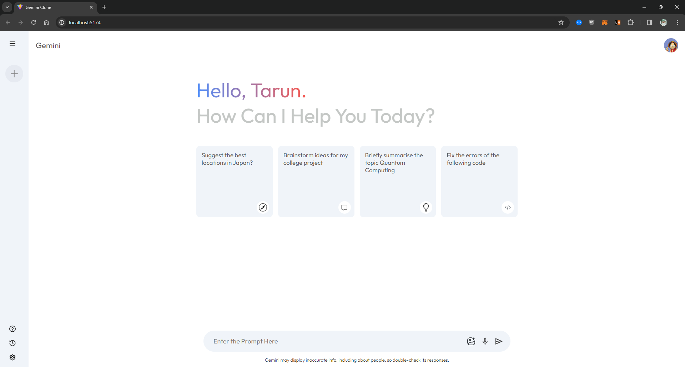
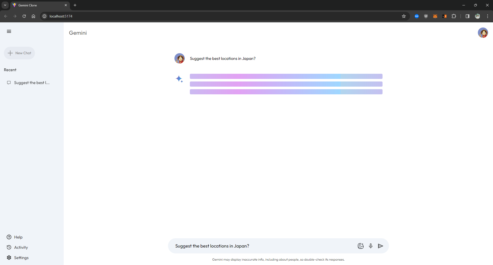
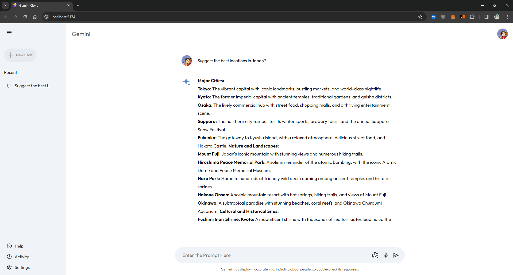

# Gemini Clone

Gemini Clone is a simplified version of the Gemini app, built using ReactJS and Vite with Gemini API integration. This project aims to replicate the basic functionalities of Gemini, such as browsing content ( without features like searching images or voice commands, accessing settings, or managing profiles )

## Installation and usage

1. Clone the repository:
```bash
git clone https://github.com/0xd15c/gemini-clone.git
```
2. Install dependencies from package file:
```bash
npm install
```
3. Run the app
```bash
npm run dev
```

## Images





